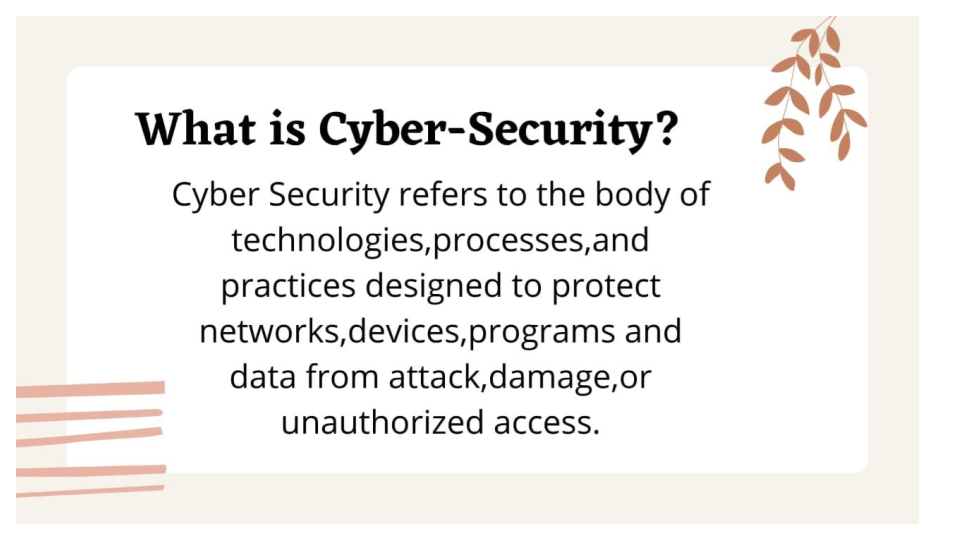
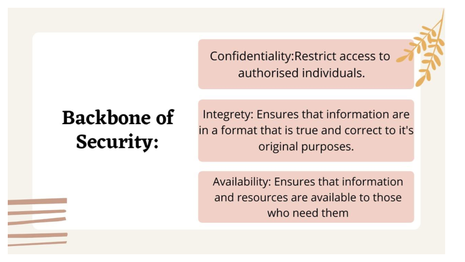
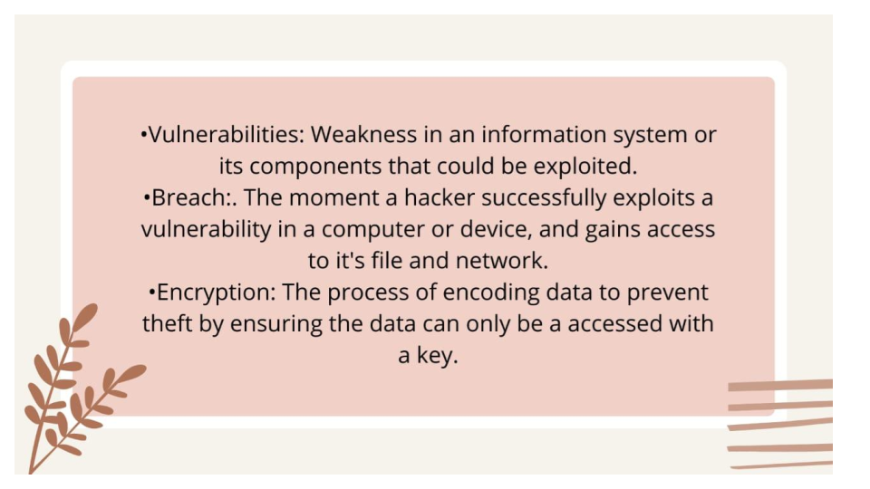
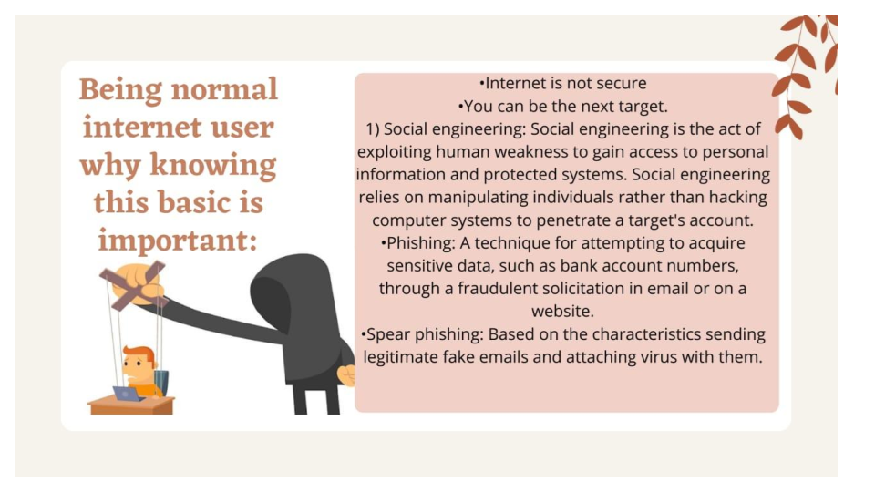
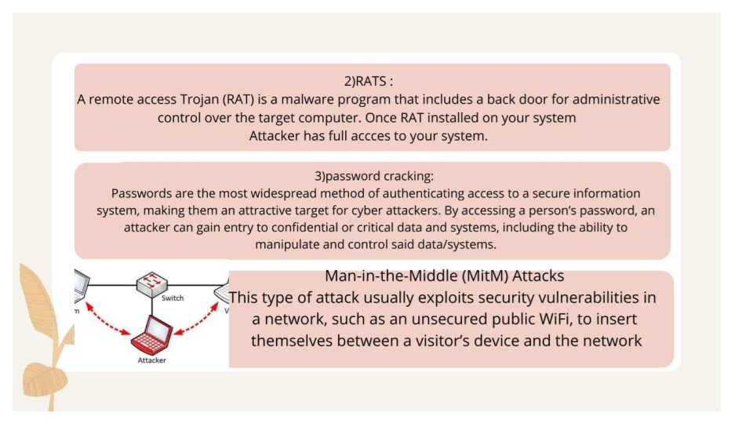
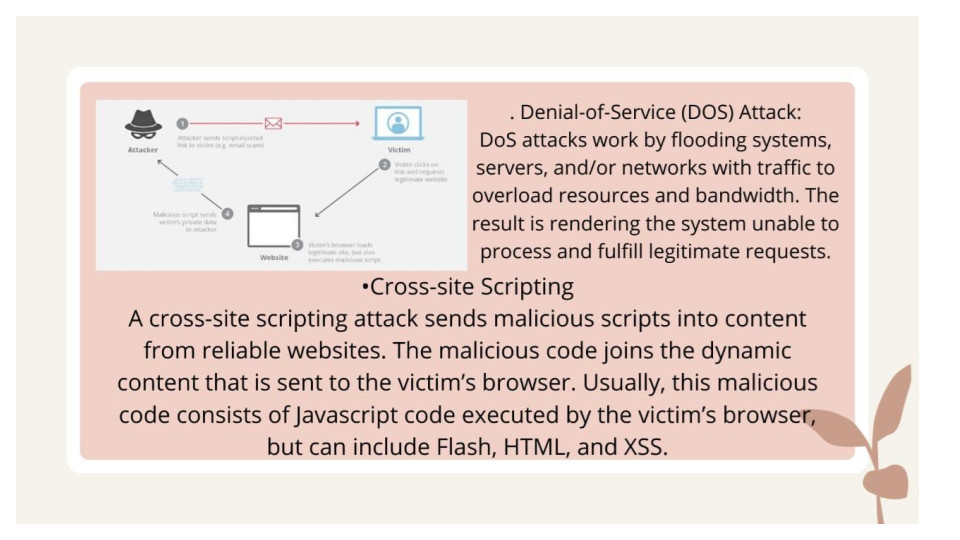
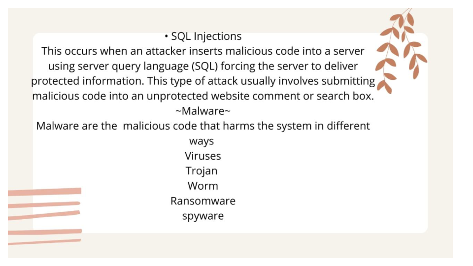
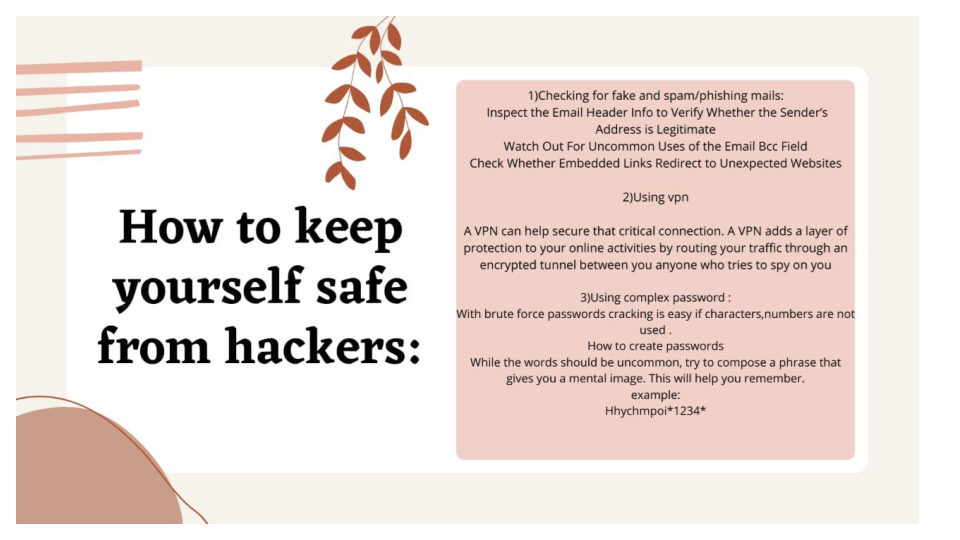
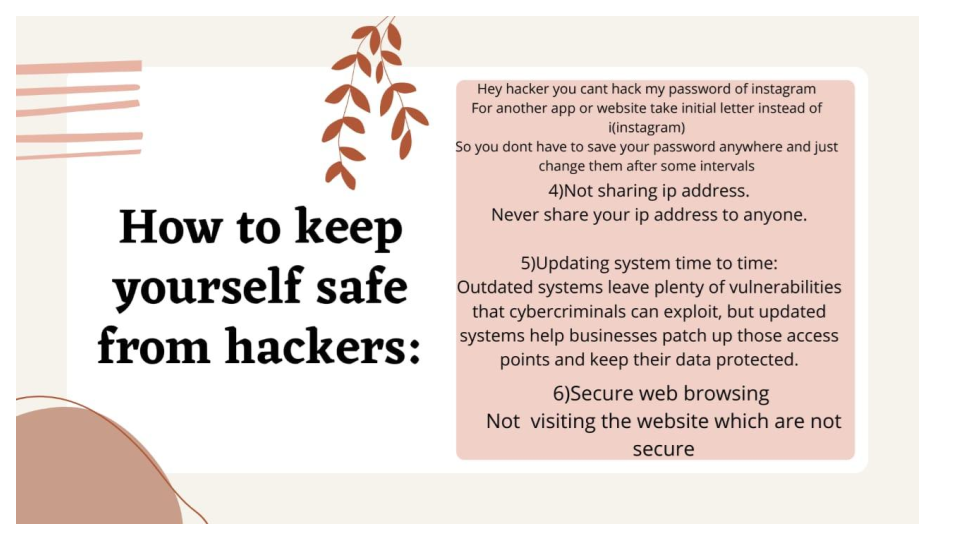
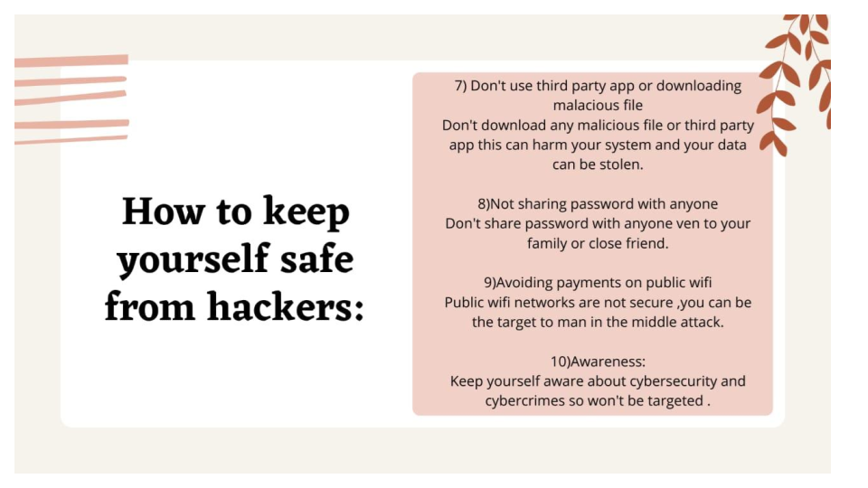

# Technical_paper_presentation 
Being internet user everyone should know some  attacks and some basic tips to prevent ourself from hackers.

 

 

 

 

 

 

 

 

 

 

 

 

###                   Thank You